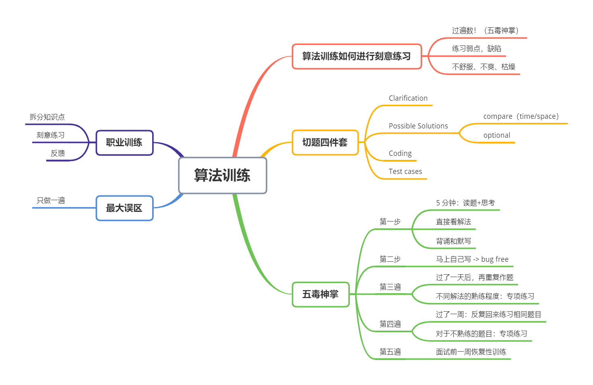

### 第一周作业情况

由于不熟悉 java 代码，所以改写代码和分析源码这两项作业暂时没有完成，会在后续课程学习过程中补充。

本周习题部分均已完成，采用 JavaScript 和 Python 两种语言书写，并简要分析了作题思路。以下是详细题目：

| 题目 | 难度 | 备注 |
| :- | :-: | :-: |
| [0001. 两数之和](./0001.%20两数之和.md) | 简单 | ✔ |
| [0021. 合并两个有序链表](./0021.%20合并两个有序链表.md) | 简单 | ✔ |
| [0026. 删除排序数组中的重复项](./0026.%20删除排序数组中的重复项.md) | 简单 | ✔ |
| [0066. 加一](./0066.%20加一.md) | 简单 | ✔ |
| [0088. 合并两个有序数组](./0088.%20合并两个有序数组.md) | 简单 | ✔ |
| [0189. 旋转数组](./0189.%20旋转数组.md) | 简单 | ✔ |
| [0283. 移动零](./0283.%20移动零.md) | 简单 | ✔ |
| [0641. 设计循环双端队列](./0641.%20设计循环双端队列.md) | 中等 |✔  |
| [0042. 接雨水](./0042.%20接雨水.md) | 困难 | ✔ |

### 学习笔记

