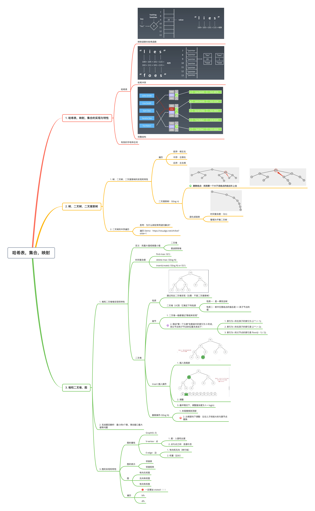

### 第二周作业情况

本周习题部分均已完成，采用 JavaScript 和 Python 两种语言书写，并简要分析了作题思路。以下是详细题目：

| 题目 | 难度 | 备注 |
| :- | :-: | :-: |
| [0242. 有效的字母异位词](./0242.%20有效的字母异位词.md) | 简单 | ✔ |
| [0001. 两数之和](./0001.%20两数之和.md) | 简单 | ✔ |
| [0094. 二叉树的中序遍历](./0094.%20二叉树的中序遍历.md) | 简单 | ✔ |
| [0144. 二叉树的前序遍历](./0144.%20二叉树的前序遍历.md) | 简单 | ✔ |
| [0347. 前 K 个高频元素](./0347.%20前%20K%20个高频元素.md) | 简单 | ✔ |
| [0429. N叉树的层序遍历](./0429.%20N叉树的层序遍历.md) | 简单 | ✔ |
| [0589. N叉树的前序遍历](./0589.%20N叉树的前序遍历.md) | 简单 | ✔ |
| [剑指 Offer 49. 丑数](./剑指%20Offer%2049.%20丑数.md) | 中等 |✔  |
| [0049. 字母异位词分组](./0049.%20字母异位词分组.md) | 中等 |✔  |

### 学习笔记

